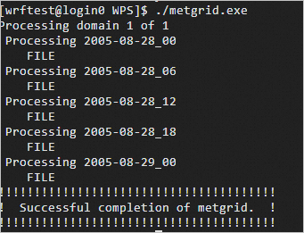

# WRF Ehpc计算巢快速部署

>**免责声明：**本服务由第三方提供，我们尽力确保其安全性、准确性和可靠性，但无法保证其完全免于故障、中断、错误或攻击。因此，本公司在此声明：对于本服务的内容、准确性、完整性、可靠性、适用性以及及时性不作任何陈述、保证或承诺，不对您使用本服务所产生的任何直接或间接的损失或损害承担任何责任；对于您通过本服务访问的第三方网站、应用程序、产品和服务，不对其内容、准确性、完整性、可靠性、适用性以及及时性承担任何责任，您应自行承担使用后果产生的风险和责任；对于因您使用本服务而产生的任何损失、损害，包括但不限于直接损失、间接损失、利润损失、商誉损失、数据损失或其他经济损失，不承担任何责任，即使本公司事先已被告知可能存在此类损失或损害的可能性；我们保留不时修改本声明的权利，因此请您在使用本服务前定期检查本声明。如果您对本声明或本服务存在任何问题或疑问，请联系我们。

## 概述

WRF（Weather Research and Forecasting）采用新一代中尺度天气预报模式，是气象行业广泛应用的开源气象模拟软件。它为研究大气过程提供了大量选项，并可以在多种计算平台运行。

## 前提条件

部署WRF社区版服务实例，需要对部分阿里云资源进行访问和创建操作。因此您的账号需要包含如下资源的权限。
  **说明**：当您的账号是RAM账号时，才需要添加此权限。

| 权限策略名称                          | 备注                     |
|---------------------------------|------------------------|
| AliyunECSFullAccess             | 管理云服务器服务（ECS）的权限       |
| AliyunVPCFullAccess             | 管理专有网络（VPC）的权限         |
| AliyunROSFullAccess             | 管理资源编排服务（ROS）的权限       |
| AliyunEHPCFullAccess             | 管理弹性高性能计算（EHPC）的权限       |
| AliyunNASFullAccess             | 管理文件存储（NAS）的权限       |
| AliyunComputeNestUserFullAccess | 管理计算巢服务（ComputeNest）的用户侧权限 |


## 计费说明

WRF社区版在计算巢部署的费用主要涉及：

- 弹性高性能计算集群（EHPC）费用
- 文件系统（NAS）费用
- 流量带宽费用

## 部署架构


- 部署由一个ehpc集群组成，ehpc集群中包括manager节点、schedule节点和compute节点
- 服务使用nas-cpfs构建高性能共享文件系统

## 参数说明
| 参数组       | 参数项      | 说明                                                                     |
|-----------|----------|------------------------------------------------------------------------|
| 服务实例      | 服务实例名称   | 长度不超过64个字符，必须以英文字母开头，可包含数字、英文字母、短划线（-）和下划线（_）                          |
|           | 地域       | 服务实例部署的地域                                                              |
|           | 付费类型     | 资源的计费类型：按量付费和包年包月                                                      |
| EHPC集群配置  | 集群登录密码   | 长度8-30，必须包含三项（大写字母、小写字母、数字、 ()`~!@#$%^&*-+=&#124;{}[]:;'<>,.?/ 中的特殊符号） | 
|           | Ehpc部署模式 | Tiny，Simple，Standard                                                   |
|           | 计算节点实例类型 | 可用区下可以使用的计算节点规格                                                        |
|           | 计算节点数量   | 计算节点数量, 可选值: 1-99                                                      |
|           | 登录节点实例类型 | 可用区下可以使用的登录节点规格                                                        |
|           | 管控节点数量   | 管控节点数量, 可选值: 1,2,4                                                     |
| EHPC集群用户配置 | 用户密码     | 长度8-30，必须包含三项（大写字母、小写字母、数字、()~!@#$%^&*-_+=\{}[]:;'/<>,.?/中的特殊符号）       |
|                | 用户名称     | 登录集群所用的用户名，默认为lammps                                                   |
| 网络配置      | 可用区      | ECS实例所在可用区                                                             |
|           | VPC ID   | 资源所在VPC                                                                |
|           | 交换机ID    | 资源所在交换机                                                                |

## 部署流程
1. 访问计算巢WRF社区版[部署链接](https://computenest.console.aliyun.com/service/instance/create/cn-hangzhou?type=user&ServiceId=service-f38983a8f42b479b8f9c)
    

2. 参数填写完成后可以看到对应询价明细，确认参数后点击**下一步：确认订单**。
   

3. 确认订单完成后同意服务协议并点击**立即创建**
   进入部署阶段。
    

## 使用流程
### 步骤一：通过控制台连接集群
1. 登录[弹性高性能计算控制台](https://ehpc.console.aliyun.com)。
2. 在顶部菜单栏左上角处，选择地域。
3. 在左侧导航栏，单击**集群**。
4. 在**集群**页面，找到在计算巢部署好的目标集群，单击**远程连接**。
    
5. 在**远程连接**页面，输入集群用户名、登录密码和端口，单击**ssh连接**。

### **步骤二：提交作业**

   本文介绍如何使用E-HPC集群运行WRF软件进行气象模拟计算。

1.查看集群是否已安装WRF相关软件。

```
export MODULEPATH=/opt/ehpcmodulefiles/
module avail
```

预期返回如下：

```
----------------------------- /opt/ehpcmodulefiles/ ------------------------
mpich/3.2       vnc             wrf-mpich/3.8.1
```

2.加载WRF软件环境。

```
module load wrf-mpich/3.8.1 mpich/3.2
echo $WPSHOME $WRFHOME
```

3.将安装的WPS和WRF软件拷贝到工作目录。

>说明:请将命令中的$WPSCOPYHOME和$WRFCOPYHOME替换为实际的工作目录，本文使用/home/wrftest作为示例。操作后，该目录下将生成WPS和WRFV3两个目录。。

```
cp -r $WPSHOME /home/wrftest
cp -r $WRFHOME /home/wrftest
```

4.进入WPS目录，然后下载并解压地表数据。

>说明:本示例中地表数据使用geog_complete.tar.gz，您也可以根据需要下载其他地表数据。

```
cd /home/wrftest/WPS
wget https://www2.mmm.ucar.edu/wrf/src/wps_files/geog_complete.tar.gz
tar -zxvf geog_complete.tar.gz
```

5.链接到GEOGRID.TBL文件。

>说明:GEOGRID.TBL文件定义了geogrid.exe需要插值到网格点上的各静态地理数据集参数。

```
ln -s geogrid/GEOGRID.TBL GEOGRID.TBL
```

6.修改namelist.wps文件。

   namelist是WPS（WRF Preprocessing System，WRF预处理系统）中的一个共享文件，该文件按照各个程序（geogrid.exe、ungrib.exe、metgrid.exe）所需要参数的不同分成三个部分（&geogrid、&ungrib、&metgrid）及一个共享部分（&share），分别定义了WPS模块所需要的各种参数。如下示例为推荐配置，未提及的参数保持默认即可。

> 1.本示例中，namelist.wps文件存放在/home/wrftest/WPS目录下。
> 2.在namelist.wps文件中，请使用!作为注释标识。

```
!共享部分
&share   
!wrf_core：选择WRF dynamical core，有'ARW'和'NMM'两个选项，默认值为'ARW'。
wrf_core = 'ARW', 
!start_date：模拟开始时间
start_date = '2005-08-28_00:00:00',  
!end_date：模拟结束时间
end_date = '2005-08-29_00:00:00',     
interval_seconds = 21600,
!max_dom：模拟网格数（粗网格+嵌套网格），本示例中包含一个粗网格
max_dom = 1, 
!#io_form_geogrid: geogrid程序输出格式
io_form_geogrid = 2,    
/

!geogrid部分
!#确定区域范围、嵌套关系、模型投影
&geogrid
parent_id = 1,
parent_grid_ratio = 1,
i_parent_start = 1,
j_parent_start = 1,

!确定网格在东西方向、南北方向的尺度（区域的矢量场的栅格数），本示例中为98*70个网格点
e_we = 98,       
e_sn = 70,
geog_data_res = 'default',

!定义区域的栅格尺寸，本示例中网格分辨率为30km
dx = 30000,     
dy = 30000,

!定义投影方式，关于投影方式说明可以参考WRF官网
map_proj = 'mercator'

!定义区域的中心经纬度坐标
ref_lat = 25.00,
ref_lon = -89.00,

!投影的三个参数值，随投影方式不同设定不同
truelat1 = 0.0,   
truelat2 = 0.0,
stand_lon = -89.0,
!geog_data_path = '地表数据存储路径'
geog_data_path = '/home/wrftest/WPS/geog'
/

!ungrib部分
&ungrib
!out_format：ungrib生成的可供metgrid读取的文件格式，有'WPS'、'SI'、'MM5'三种格式，默认值为'WPS'
out_format = 'WPS', 
!prefix：ungrib生成的中间文件路径和文件前缀名
prefix = 'FILE'
/
 
!metgrid部分 
&metgrid  
!fg_name：ungrib程序生成的文件
fg_name = 'FILE', 
!io_form_metgrid：metgrid生成的文件格式
!支持三种格式1（binary，后缀名.int）、2（net CDF，后缀名.nc）、3（Grib1，后缀名.gr1）
!默认值：2
io_form_metgrid = 2
/
```

7.将静态地形数据插值到网格点。

```
./geogrid.exe
```

运行geogrid.exe成功后，会在/home/wrftes/WPS目录下生成geo_em.d0N.nc地形文件，预期返回结果如下：


### **步骤三：运行ungrib.exe**

ungrib.exe用于从GRIB格式的气象数据中提取所需要的气象要素场。

1.下载并解压Katrina气象数据。

>说明: 本示例中气象数据为Katrina.tar.gz，请下载Katrina.tar.gz。您也可以根据需要下载其他气象数据。

```
cd /home/wrftest/WPS
wget http://www2.mmm.ucar.edu/wrf/TUTORIAL_DATA/Katrina.tar.gz
tar -zxvf Katrina.tar.gz
```

2.通过link_grib.csh脚本链接气象数据。

```
./link_grib.csh /home/wrftest/WPS/Katrina/avn*
```

3.选择气象数据相应的Vtable。
本示例使用的Vtable为Vtable.GFS，您可以根据需要使用其他的Vtable。

```
ln -sf ungrib/Variable_Tables/Vtable.GFS Vtable
```

4.提取所需要的气象要素场。

```
./ungrib.exe
```

运行ungrib.exe成功后，会在/home/wrftes/WPS目录下生成FILE:YYYY-MM-DD_hh*文件，预期返回结果如下：


### **步骤四：运行metgrid.exe**

metgrid.exe用于将ungrib.exe提取出的气象场数据水平插值到由geogrid.exe确定的网格点上。

1.链接到GEOGRID.TBL文件。

GEOGRID.TBL文件定义了metgrid.exe如何将气象数据水平插值到网格点上。

```
cd /home/wrftest/WPS
ln -s metgrid/METGRID.TBL.ARW METGRID.TBL
```

2.将气象场数据水平插值到由geogrid确定的网格点上。

```
./metgrid.exe
```

运行metgrid.exe成功后，会在/home/wrftes/WPS目录下生成met_em.d0N.yyyy-mm-dd_hh:mm:ss.nc文件，预期返回结果如下：



### **步骤五：运行wrf.exe**

wrf.exe用于输出天气预测数据。

1.连接WPS的处理结果。

```
cd /home/wrftest/WRFV3
ln -s /home/wrftest/WPS/met_em.d01.2005-08-2*.
```

> 注意: 此处要是连接不成功，会导致后面的wrfinput_d01、wrfbdy_d01文件创建不出来，您可以将/home/wrftest/WPS文件夹下met_em.d01.2005-08-2开头的文件拷贝到/home/wrftest/WRFV3文件夹下。


2.修改namelist.input文件。

```
cd /home/wrftest/WRFV3/run
vim namelist.input
```

namelist.input文件中&time_control、&domains部分的相关参数需要与namelist.wps文件中的参数保持一致。本文使用的配置示例如下:

```
&time_control
run_days                            = 0,
run_hours                           = 12,
run_minutes                         = 0,
run_seconds                         = 0,
start_year                          = 2005, 2005, 2005,
start_month                         = 08,   08,   08,
start_day                           = 28,   28,   28,
start_hour                          = 00,   00,   00,
start_minute                        = 00,   00,   00,
start_second                        = 00,   00,   00,
end_year                            = 2005, 2005, 2005,
end_month                           = 08,   08,   08,
end_day                             = 29,   29,   29,
end_hour                            = 00,   00,   00,
end_minute                          = 00,   00,   00,
end_second                          = 00,   00,   00,
interval_seconds                    = 21600
input_from_file                     = .true.,.true.,.true.,
history_interval                    = 180,  60,   60,
frames_per_outfile                  = 1000, 1000, 1000,
restart                             = .false.,
restart_interval                    = 5000,
io_form_history                     = 2
io_form_restart                     = 2
io_form_input                       = 2
io_form_boundary                    = 2
debug_level                         = 0
iofields_filename                   = "extraoutput_d01.txt"
/

&domains
time_step                           = 180,
time_step_fract_num                 = 0,
time_step_fract_den                 = 1,
max_dom                             = 1,
e_we                                = 98,    112,   94,
e_sn                                = 70,    97,    91,
e_vert                              = 30,    30,    30,
p_top_requested                     = 5000,
num_metgrid_levels                  = 27,
num_metgrid_soil_levels             = 4,
dx                                  = 30000, 10000,  3333.33,
dy                                  = 30000, 10000,  3333.33,
grid_id                             = 1,     2,     3,
parent_id                           = 0,     1,     2,
i_parent_start                      = 1,     31,    30,
j_parent_start                      = 1,     17,    30,
parent_grid_ratio                   = 1,     3,     3,
parent_time_step_ratio              = 1,     3,     3,
feedback                            = 1,
smooth_option                       = 0,
/

&physics
mp_physics                          = 6,     6,     6,
ra_lw_physics                       = 4,     4,     4,
ra_sw_physics                       = 4,     4,     4,
radt                                = 10,    10,    10,
sf_sfclay_physics                   = 1,     1,     1,
sf_surface_physics                  = 2,     2,     2,
bl_pbl_physics                      = 1,     1,     1,
bldt                                = 0,     0,     0,
cu_physics                          = 0,     0,     0,
cudt                                = 0,     0,     0,
isfflx                              = 1,
ifsnow                              = 0,
icloud                              = 1,
surface_input_source                = 1,
num_soil_layers                     = 4,
sf_urban_physics                    = 0,     0,     0,
/


&fdda
/

&dynamics
w_damping                           = 0,
diff_opt                            = 1,      1,      1,
km_opt                              = 4,      4,      4,
diff_6th_opt                        = 0,      0,      0,
diff_6th_factor                     = 0.12,   0.12,   0.12,
base_temp                           = 290.
damp_opt                            = 0,
zdamp                               = 5000.,  5000.,  5000.,
dampcoef                            = 0.2,    0.2,    0.2
khdif                               = 0,      0,      0,
kvdif                               = 0,      0,      0,
non_hydrostatic                     = .true., .true., .true.,
moist_adv_opt                       = 1,      1,      1,     
scalar_adv_opt                      = 1,      1,      1,     
/

&bdy_control
spec_bdy_width                      = 5,
spec_zone                           = 1,
relax_zone                          = 4,
specified                           = .true., .false.,.false.,
nested                              = .false., .true., .true.,
/

&grib2
/

&namelist_quilt
nio_tasks_per_group = 0,
nio_groups = 1,
/
```

3.初始化模拟数据。

```
./real.exe
```

运行real.exe成功后，会在/home/wrftest/WRFV3/run目录下生成wrfinput_d01、wrfbdy_d01文件。

4.输出天气预测数据。

编写作业脚本

```
vim wrf.slurm
```

wrf.slurm的内容示例如下：

```
#!/bin/bash
#SBATCH -N 1
#SBATCH -n 2
#SBATCH --cpus-per-task=1
#SBATCH -J wrf-test
#SBATCH -o wrf_test.log

module load wrf-mpich/3.8.1 mpich/3.2
mpirun -np 2 -ppn 1  -bind-to core:1 /home/wrftest/WRFV3/run/wrf.exe
```

提交作业

```
batch < wrf.slurm
```

> 注意：要是执行不成功请查看wrf_test.log文件，如发生以下错误，请执行： export LD_LIBRARY_PATH=/opt/WRF_WPS-mpich-3.8.1/util/lib:$LD_LIBRARY_PATH


作业运行成功后，会在/home/wrftest/WRFV3/run目录下生成wrfout_d01_[date]文件，例如：wrfout_d01_2005-08-28_00:00:00。


### **步骤六：安装NCL**

以下是在 CentOS 7.6 上安装 Miniconda 和 NCL 的步骤：

1.创建ncl文件夹

```
cd /home/wrftest/WRFV3/run
mkdir ncl
```

2.下载 Miniconda 安装脚本。您可以通过以下命令从 Miniconda 官方网站下载最新版本：

```
wget https://repo.anaconda.com/miniconda/Miniconda3-latest-Linux-x86_64.sh
```

3.运行安装脚本以安装 Miniconda。使用以下命令运行脚本：

```
bash Miniconda3-latest-Linux-x86_64.sh
```

4.刷新环境变量，此时前面会出现（base）。

```
source ~/.bashrc
```

5.查看安装conda的版本。

```
conda -V
```

6.更新conda。遇到yes/no的时候都是yes。

```
conda update -n root --all
```

7.安装ncl。

```
conda create -n ncl_stable -c conda-forge ncl
```

8.进入ncl交互模式

```
conda activate ncl_stable
ncl
```

> 说明：当输入完ncl命令，屏幕出现: ncl 0> ,就算是安装成功。


9.退出交互模式

```
exit
```

### **步骤七：使用NCL图像化WRF运行结果**

1.创建ncl文件

将步骤五的运行结果转化为.ncl文件

```
cd /home/wrftest/WRFV3/run
vim wrf_test.ncl
```

将下面内容写入wrf_test.ncl文件中

```
 load "$NCARG_ROOT/lib/ncarg/nclscripts/csm/gsn_code.ncl" 
 load "$NCARG_ROOT/lib/ncarg/nclscripts/wrf/WRFUserARW.ncl"
begin 
  a = addfile("/home/wrftest/WRFV3/run/wrfout_d01_2005-08-28_00:00:00","r") 
  ter = wrf_user_getvar(a,"HGT",0) ; Get terrain height for time 0 
  wks = gsn_open_wks("png","test") ; Create a plot workstation 
  opts = True ; Set some Basic Plot options 
  opts@MainTitle = "GEOGRID FIELDS" 
  res = opts ; Use basic options for this field 
  res@cnFillOn = True ; Create a color fill plot 
  contour = wrf_contour(a,wks,ter,res) ; 单独contour没有画面 
  pltres = True ; Set plot options 
  mpres = True ; Set map options 
  mpres@mpGeophysicalLineColor = "Black" ; Overwrite basic map settings 
  mpres@mpGridLineColor = "Black" 
  mpres@mpLimbLineColor = "Black" 
  mpres@mpNationalLineColor = "Black" 
  mpres@mpPerimLineColor = "Black" 
  mpres@mpUSStateLineColor = "Black" 
  plot = wrf_map_overlays(a,wks,(/contour/),pltres,mpres) ; Plot the data over a map background 
end
```

2.使用ncl运行wrf_test.ncl文件。

```
conda activate ncl_stable
ncl wrf_test.ncl
```

> 说明：执行成功后会在当前文件夹下生成test.png文件


### **步骤八：查看test.png**

本文使用给计算节点挂载EIP的方式，将png图片文件下载到本地查看

1.在EHPC控制台找到计算节点实例


2.创建弹性公网IP并与计算实例绑定


3.将图片传输到本地并查看

```
scp root@公网IP:/home/wrftest/WRFV3/run/test.png ./
```

